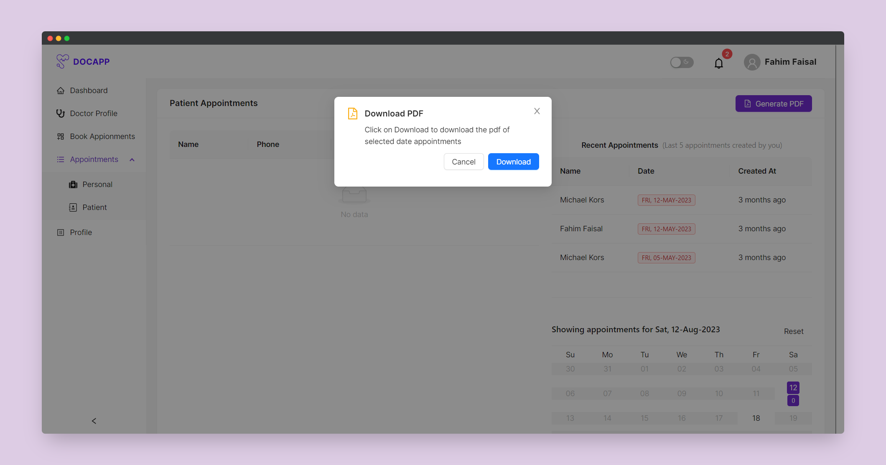

<h1 style="text-align: center;">DOCAPP</h3>
<p style="text-align: center;">A doctor appointment app</p>

## Table of Contents

-   [Introduction](#introduction)
-   [Features](#features)
-   [Installation](#installation)
-   [Environment Variables](#environment-variables)
    -   [Client](#client)
    -   [Server](#server)
-   [Run server and client](#run-server-and-client)
    -   [Start the server](#start-the-server)
    -   [Start the client](#start-the-client)
-   [API Endpoints](#api-endpoints)
-   [Screenshots](#screenshots)
-   [License](#license)

## Introduction

This is a doctor appointment app that allows users to book an appointment with a doctor. It also allows doctors to manage their appointments. It is built with Nodejs, Express, MongoDB and React. It is a monolithic application. The frontend is built with React and the backend is built with Nodejs and Express. The database used is MongoDB.

## Features

-   Users

    -   Users can sign up.
    -   Users can sign in.
    -   Users can book an appointment with a doctor.
    -   Users can view their appointments.
    -   Users can apply for a doctor position.

-   Doctors

    -   Doctors can sign in.
    -   Doctors can view their appointments.
    -   Doctors can also book an appointment with another doctor.
    -   Doctors can view their appointments.
    -   Doctors can view their patients.
    -   Doctors can view their profile.
    -   Doctors can generate a pdf of their appointments.

-   Admin

    -   Admin can sign in.
    -   Admin can view all appointments.
    -   Admin can view all users.
    -   Admin can view all doctors.
    -   Admin can accept/recect doctors account request.
    -   Admin can view and add/edit all departments.

## Installation

### Requirements

-   Nodejs
-   MongoDB account
-   Cloudinary account

### Steps

#### Clone the repository

```bash
git clone https://github.com/b-l-i-n-d/docapp.git
```

#### Change directory

```bash
cd docapp
```

#### Install dependencies

Client

```bash
cd client
npm install
```

Server

```bash
cd server
npm install
```

#### Create a .env file in the server directory and add the environment variables from [environment variables section](#environment-variables)

#### Seed the database

```bash
cd server
npm run seed
```

#### Run the server and client

Follow the steps in [Run server and client section](#run-server-and-client)

## Environment Variables

### Client

Create a .env file in the client directory and add the following

```bash
#Theme
VITE_THEME_LIGHT='light'
VITE_THEME_DARK='dark'

#API URL
VITE_API_URL='<API URL><BACKEND URL PREFIX>' // e.g https://docapp-api.onrender.com/api/v1

#PAGE SIZE
VITE_PAGE_SIZE=10
VITE_NOTIFICATION_PAGE_SIZE=4
```

### Server

Create a .env file in the server directory and add the following

```bash
#DB
MONGODB_URI='<MONGODB URI>'
PORT=<PORT>

#CLIENT URL
CLIENT_URL='<CLIENT URL>'

#BACKEND URL PREFIX
BACKEND_URL_PREFIX='/api/v1'

#JWT
JWT_ACCESS_SECRET='<JWT ACCESS SECRET>'
JWT_REFRESH_SECRET='<JWT REFRESH SECRET>'
ACCESS_EXP='<ACCESS TOKEN EXPIRY>' // in seconds
REFRESH_EXP='<REFRESH TOKEN EXPIRY>' // in seconds

#cookies
COOKIE_ACCESS_NAME='<ACCESS TOKEN COOKIE NAME>' // e.g. access_token
COOKIE_REFRESH_NAME='<REFRESH TOKEN COOKIE NAME>' // e.g. refresh_token

#cloudinary
CLOUDINARY_CLOUD_NAME='<CLOUDINARY CLOUD NAME>'
CLOUDINARY_API_KEY='<CLOUDINARY API KEY>'
CLOUDINARY_API_SECRET='<CLOUDINARY API SECRET>'

#NodeMailer
APP_EMAIL='<APP EMAIL>' // used gmail as service you can use free ethereal email as smtp service
APP_PASSWORD='<APP PASSWORD>'
```

## Run server and client

### Start the server

```bash
cd server
npm run start
```

or

```bash
cd server
yarn start
```

### Start the client

```bash
cd client
npm run dev
```

or

```bash
cd client
yarn dev
```

## Api endpoints

### Users

| Route                                | Method | Description                |
| ------------------------------------ | ------ | -------------------------- |
| `/api/v1/users`                      | GET    | All users                  |
| `/api/v1/users/signup`               | POST   | Sign up                    |
| `/api/v1/users/login`                | POST   | Log in                     |
| `/api/v1/users/logout`               | GET    | Log out                    |
| `/api/v1/users/verifyToken`          | GET    | Verify auth tokens         |
| `/api/v1/users/requestPasswordReset` | POST   | Request for password reset |
| `/api/v1/users/resetPassword`        | PATCH  | Reset password             |
| `/api/v1/users/notifications`        | GET    | All notifications          |
| `/api/v1/users/notifications/:id`    | Patch  | Edit Single notification   |
| `/api/v1/users/notifications/:id`    | Delete | Delete Single notification |

### Doctors

| Route                               | Method | Description                                                     |
| ----------------------------------- | ------ | --------------------------------------------------------------- |
| `/api/v1/doctors`                   | GET    | All doctors                                                     |
| `/api/v1/doctors`                   | POST   | Create new doctor                                               |
| `/api/v1/doctors/approved`          | GET    | Approved doctor                                                 |
| `/api/v1/doctors/me`                | GET    | Logged user doctor info                                         |
| `/api/v1/doctors/:id`               | GET    | Get doctor by doctor id                                         |
| `/api/v1/doctors/:id`               | PATCH  | Edit doctor                                                     |
| `/api/v1/doctors/:id/update-status` | PATCH  | Update doctor status by id (approve or reject) - only for admin |

### Appointments

| Route                     | Method | Description              |
| ------------------------- | ------ | ------------------------ |
| `/api/v1/appointments`    | GET    | All appointments         |
| `/api/v1/appointments`    | POST   | Create new appointment   |
| `/api/v1/appointments/me` | GET    | Logged user appointments |

### Departments

| Route                     | Method | Description       |
| ------------------------- | ------ | ----------------- |
| `/api/v1/departments`     | GET    | All departments   |
| `/api/v1/departments`     | POST   | Create new dept   |
| `/api/v1/departments/:id` | GET    | Get dept by id    |
| `/api/v1/departments/:id` | PATCH  | Edit dept by id   |
| `/api/v1/departments/:id` | DELETE | Delete dept by id |

### Districts

| Route                   | Method | Description         |
| ----------------------- | ------ | ------------------- |
| `/api/v1/districts`     | GET    | All districts       |
| `/api/v1/districts/:id` | GET    | Get district by id  |
| `/api/v1/districts/:id` | PATCH  | Edit district by id |

### Workplaces

| Route                | Method | Description    |
| -------------------- | ------ | -------------- |
| `/api/v1/workplaces` | GET    | All workplaces |

## Screenshots

### Auth


### User

#### Home


#### Appointments

##### Approved doctors


##### Book appointment page


##### Booking details


##### Logged user appointments


#### Profile


### Doctor

#### Dashboard


#### Doctor profile


#### Patients Appointments


#### Generate pdf



### Admin

#### Dashboard


#### All users


#### All doctors


#### All departments


## License

[MIT](https://choosealicense.com/licenses/mit/)
